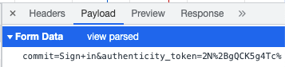

개요
---

IntelliJ 플러그인으로 IDE 안에서 .hdf 파일을 생성/수정/실행할 수 있는 기능을 제공합니다.

플러그인 설치 방법
-------------- 

- github 페이지의 오른쪽 메뉴에서 Releases 로 들어가서 httpflow-intellij-plugin-0.0.1.jar 를 다운로드 받습니다.

- IntelliJ의 preferences > plugins 에서 우측 상단의 톱니바퀴를 클릭해서 ```Install Plugin from Disk```를 선택합니다.<br/>


- 파일 찾기 창이 열리면 위에서 다운로드 받은 httpflow-intellij-plugin-0.0.1.jar를 선택합니다.

- 아래와 같이 설치가 완료되면 IntelliJ를 재시작 해주면 됩니다.


*.hdf 파일 생성 및 실행 방법
-----------------------

일반적인 텍스트 파일을 생성하듯이 IntelliJ 에서 New(Command+N) > File 로 원하는 이름의 *.hfd 파일을 생성하고,<br/>
httpflow definition 파일 내용을 작성해줍니다.  


httpflow definition 파일 내용은 새로 개발하는 API를 호출하는게 아니라, 이미 서비스되고 있는 API를 호출하는 경우<br/>
아래와 같이 크롬의 개발자 도구 > Network > Headers > Request Headers에서 쉽게 복사할 수 있습니다.


- 위 예제에서는 authority, method, path, scheme 4가지만 복사 했는데.. 기타 필요한 header 값을 모두 복사하면 됩니다.

- POST, PUT 메소드인 경우 Request body 가 존재하는데, 위 Request Headers 다음 아래 영역에 ```Form Data```로<br/>
표시되거나, 아래 이미지와 같이 headers 우측의 payload 탭에 ```Form Data```로 표시됩니다. 


- 위와 같이 데이터가 parse 되어서 표시되는데 위 이미지의 ```view source``` 를 클릭해서 아래와 같이<br/> 
raw 데이터 형태로 표시 후 복사해 줍니다.



- 복사한 내용을 *.hfd 파일에 아래와 같이 붙여 넣어주면 되는데, 5번 라인에서와 같이 header와 body 영역은 1칸 띄워줘야 합니다.


- 실행은 위 이미지의 편집기 좌측에 있는 초록색 삼각형 모양의 아이콘을 클릭하면 됩니다.<br/>
  실행하면 콘솔창에는 상태 정보가 표시되고, API 응답으로 받은 텍스트 데이터는 ```dumpfile``` 폴더에 파일로 저장됩니다. 
  
  

개발 참여 방법
-----------------------

httpflow-intellij-plugin 을 로컬에 소스 레벨로 다운로드 받아서 실행 및 수정하려는 개발자분들은<br/>
아래 가이드를 참고하시면 됩니다.

[개발자 가이드](readme/developer_guide.md)