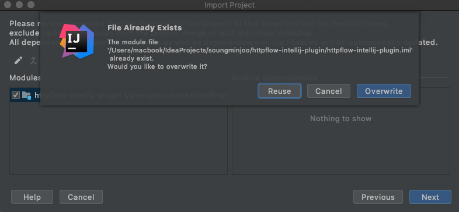

개발환경 구축
----------

IntelliJ 에서 VCS > Get from Version Control 로 현재 프로젝트를 clone 받습니다.

clone 받은 후에 import module단계에서 아래와 같이 진행하면 됩니다.

- 5번째 httpflow-intellij-plugin.iml 를 reuse할지 overwrite할지 물어보는 화면 까지는<br/>
Next 로 쭉 진행하면 되고, 5번째 화면에서 ```reuse``` 를 선택합니다.

- 6번째 화면에서는 기본 JDK 말고 'IntelliJ IDEA...' 로 시작하는 SDK를 선택합니다.<br/>
(개인별로 설치 하신 IntelliJ 버전에 따라 이름이 다를 수 있습니다.)


아래 화면과 같이 reuse와 overwrite를 물어보면 ```reuse```를 선택해야 합니다.


아래 화면과 같이 SDK를 여러개 중에 선택 가능한데, 꼭 ```IntelliJ IDEA...``` 로 시작하는 SDK를 선택해야 합니다.


실행방법
------

IntelliJ에서 Run/Debug Configuration 창으로 들어와서 아래와 같이 ```+``` 아이콘을 클릭하여<br/>
plugin을 검색해서 선택해주면 그 아래 그림과 같이 오른쪽 영역에 실행 설정이 표시됩니다.


아래 실행 설정에서는 이름만 원하는 이름으로 변경후 OK를 눌러주면 됩니다. 


- ```use classpath of module``` 영역이 제대로 안나오는 경우는 위에서 import module할때,<br/>
5번째 화면에서 reuse하지 않고 overwrite한 경우로 프로젝트를 지우고 다시 import 해보시기 바랍니다.

- 실행시 ```com.intellij.idea.Main``` 클래스를 못찾는 경우는 위에서 import module할때,<br/>
6번째 화면에서 SDK를 잘못 선택한 경우로, 위의 Run/Debug Configuration으로 가서 SDK를 다시<br/>
```IntelliJ IDEA...``` 로 시작하는 SDK로 변경해주면 됩니다.
